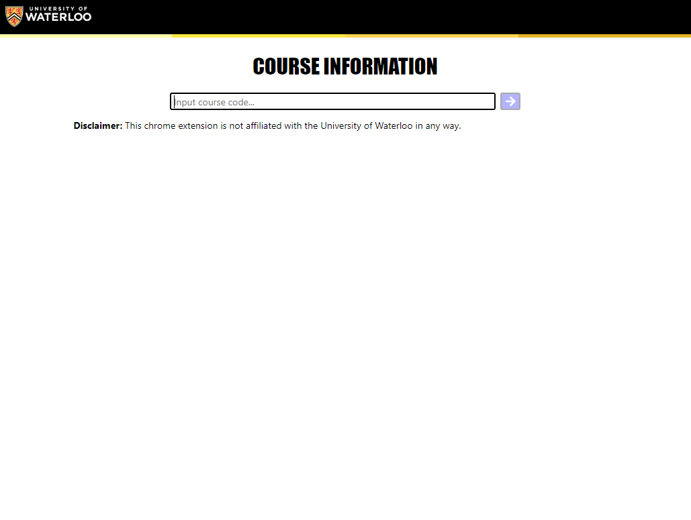
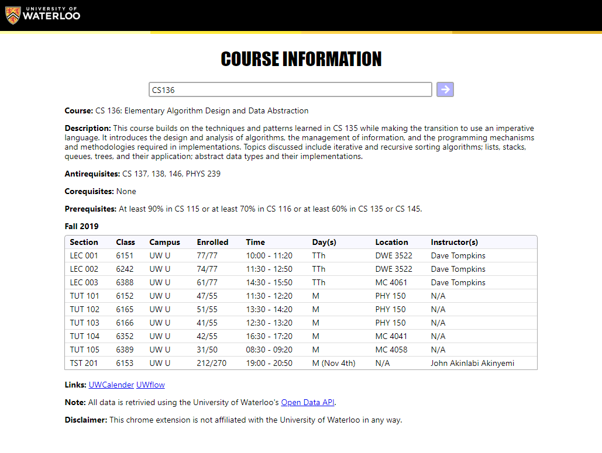

# UWaterloo Course Info Finder Website Version

Minimalistic Website implementation that takes advantage of University of [Waterloo's Open Data API](https://github.com/uWaterloo/OpenData) to retrive and display course offerings with a responsive design. Currently includes all lecture/tutorial/lab/seminar times, dates, classrooms, student capacity, professor(s), exam dates, class ID, etc.

Website can be found [here](https://uwaterlooinfo.tech). There's also a chrome extension version that can be found [here](https://chrome.google.com/webstore/detail/uwaterloo-course-info-fin/jeegfhbaeffbaiijbmpcdgkahphfande).

## Screenshots

